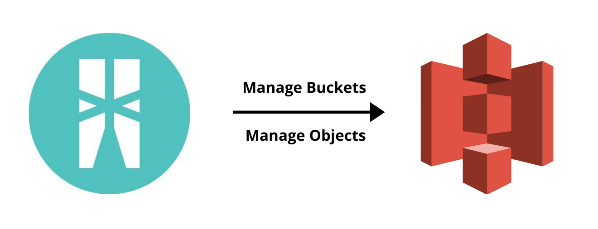

[](https://travis-ci.org/ballerina-platform/module-ballerinax-aws.s3)
[](https://github.com/ballerina-platform/module-ballerinax-aws.s3./commits/master)
[](https://opensource.org/licenses/Apache-2.0)

# Ballerina Amazon S3 Connector 
Connects to Amazon S3 using Ballerina.

# Introduction
## Amazon S3
[Amazon Simple Storage Service (Amazon S3)](https://aws.amazon.com/s3/) is an object storage service that offers industry-leading scalability, data availability, security, and performance.This means customers of all sizes and industries can use it to store and protect any amount of data for a range of use cases, such as data lakes, websites, mobile applications, backup and restore, archive, enterprise applications, IoT devices, and big data analytics. 

## Key Features of Amazon S3
* Manage buckets
* Manage objects 

## Connector Overview

The Amazon S3 Connector allows you to access the Amazon S3 REST API through Ballerina. The following sections provide the details on client operations.

**Buckets Operations**
Connector contains operations that list the existing buckets, create a bucket, delete a bucket, and list objects in a bucket.

**Objects Operations**
Connector contains operations that create an object, delete an object, and retrieve an object.




## Compatibility
| Ballerina Language Version | Amazon S3 API version  |
| -------------------------- | ---------------------- |
|     Swan Lake Alpha4       |       2006-03-01       |


### Obtaining Access Keys

You need to get credentials such as **Access Key** and **Secret Access Key (API Secret)** from Amazon S3.

1. Create an Amazon account by visiting <https://aws.amazon.com/s3/>
2. Create a new access key, which includes a new secret access key.
- To create a new secret access key for your root account, use the [security credentials](https://console.aws.amazon.com/iam/home?#security_credential) page. Expand the Access Keys section, and then click **Create New Root Key**.
- To create a new secret access key for an IAM user, open the [IAM console](https://console.aws.amazon.com/iam/home?region=us-east-1#home). Click **Users** in the **Details** pane, click the appropriate IAM user, and then click **Create Access Key** on the **Security Credentials** tab.
3. Download the newly created credentials, when prompted to do so in the key creation wizard.

## Running Tests

1. Create `Config.toml` file in `module-ballerinax-aws.s3` with the following configurations and provide appropriate value.

    ```
    accessKeyId = "testAccessKeyValue"
    secretAccessKey = "testSecretAccessKeyValue"
    region = "testRegion"
    testBucketName = "testBucketName"
    ```

2. Navigate to the `module-ballerinax-aws.s3` directory.

3. Run tests :

    ```ballerina
    bal test
    ```

# Quickstart

## Create a bucket
### Step 1: Import the AWS S3 module
First, import the `ballerinax/aws.s3` module into the Ballerina project.
```ballerina
import ballerinax/aws.s3;
```

### Step 2: Initialize the Calendar Client giving necessary credentials
You can now enter the credentials in the S3 client config.
```ballerina
s3:ClientConfiguration amazonS3Config = {
    accessKeyId: <ACCESS_KEY_ID>,
    secretAccessKey: <SECRET_ACCESS_KEY>,
    region: <REGION>
};

s3:Client amazonS3Client = check new (amazonS3Config);
```

### Step 3: Set up all the data required to create the bucket
The `createBucket` remote function creates an event. The `bucketName` represents the name of the bucket that has to be created. This operation returns an `error` if unsuccessful. 

```ballerina
string bucketName = "name";
```

### Step 4: Create bucket
The response from `createBucket` is an `error` if creating the bucket was unsuccessful.

```ballerina
//Create new bucket.
error? createBucketResponse = amazonS3Client->createBucket(bucketName);
if (createBucketResponse is error) {
    // If unsuccessful
    log:printError("Error: " + createBucketResponse.toString());
} else {
    // If successful
    log:printInfo("Bucket Creation Status: Success");
}
```

# Samples

Samples are available at : https://github.com/ballerina-platform/module-ballerinax-aws.s3/tree/master/samples. To run a sample, create a new TOML file with name `Config.toml` in the same directory as the `.bal` file with above-mentioned configurable values.

### Create a new bucket

This sample shows how to create a bucket in AWS. The bucket name is required to do this operation. This operation returns an `error` if unsuccessful. 

```ballerina
import ballerina/log;
import ballerinax/aws.s3;

configurable string accessKeyId = ?;
configurable string secretAccessKey = ?;
configurable string region = ?;
configurable string bucketName = ?;

s3:ClientConfiguration amazonS3Config = {
    accessKeyId: accessKeyId,
    secretAccessKey: secretAccessKey,
    region: region
};

s3:Client amazonS3Client = check new (amazonS3Config);

public function main() {
    s3:CannedACL cannedACL = s3:ACL_PRIVATE;
    error? createBucketResponse = amazonS3Client->createBucket(bucketName, cannedACL);
    if (createBucketResponse is error) {
        log:printError("Error: " + createBucketResponse.toString());
    } else {
        log:printInfo("Bucket Creation Status: Success");
    }
}
```

### List buckets

This sample shows how to list all buckets that are available in an authorized user's account. This operation returns array of `Bucket` if successful. Else returns `error`. 

```ballerina
import ballerina/log;
import ballerinax/aws.s3;

configurable string accessKeyId = ?;
configurable string secretAccessKey = ?;
configurable string region = ?;

s3:ClientConfiguration amazonS3Config = {
    accessKeyId: accessKeyId,
    secretAccessKey: secretAccessKey,
    region: region
};

s3:Client amazonS3Client = check new (amazonS3Config);

public function main() {
    var listBucketResponse = amazonS3Client->listBuckets();
    if (listBucketResponse is s3:Bucket[]) {
        log:printInfo("Listing all buckets: ");
        foreach var bucket in listBucketResponse {
            log:printInfo("Bucket Name: " + bucket.name);
        }
    } else {
        log:printError("Error: " + listBucketResponse.toString());
    }
}
```

### Create a new object

This sample shows how to create a object in a bucket. The bucket name, object name and file content are required to do this operation. This operation returns an `error` if unsuccessful. 

```ballerina
import ballerina/log;
import ballerinax/aws.s3;

configurable string accessKeyId = ?;
configurable string secretAccessKey = ?;
configurable string region = ?;
configurable string bucketName = ?;

s3:ClientConfiguration amazonS3Config = {
    accessKeyId: accessKeyId,
    secretAccessKey: secretAccessKey,
    region: region
};

s3:Client amazonS3Client = check new (amazonS3Config);

public function main() {
    error? createObjectResponse = amazonS3Client->createObject(bucketName, "test.txt", "Sample content");
    if (createObjectResponse is error) {
        log:printError("Error: "+ createObjectResponse.toString());
    } else {
        log:printInfo("Object created successfully");
    }
}
```

### List objects

This sample shows how to list all objects that are available in a bucket. This operation returns array of `S3Object` if successful. Else returns `error`. 

```ballerina
import ballerina/log;
import ballerinax/aws.s3;

configurable string accessKeyId = ?;
configurable string secretAccessKey = ?;
configurable string region = ?;
configurable string bucketName = ?;

s3:ClientConfiguration amazonS3Config = {
    accessKeyId: accessKeyId,
    secretAccessKey: secretAccessKey,
    region: region
};

s3:Client amazonS3Client = check new (amazonS3Config);

public function main() returns error? {
    var listObjectsResponse = amazonS3Client->listObjects(bucketName);
    if (listObjectsResponse is s3:S3Object[]) {
        log:printInfo("Listing all object: ");
        foreach var s3Object in listObjectsResponse {
            log:printInfo("---------------------------------");
            log:printInfo("Object Name: " + s3Object["objectName"].toString());
            log:printInfo("Object Size: " + s3Object["objectSize"].toString());
        }
    } else {
        log:printError("Error: " + listObjectsResponse.toString());
    }
}
```

### Get an object

This sample shows how to get an object that is available in a bucket. The bucket name and object name are required to do this operation. This operation returns a `S3Object` if successful. Else returns `error`. 

```ballerina
import ballerina/log;
import ballerina/lang.'string as strings;
import ballerinax/aws.s3;

configurable string accessKeyId = ?;
configurable string secretAccessKey = ?;
configurable string region = ?;
configurable string bucketName = ?;

s3:ClientConfiguration amazonS3Config = {
    accessKeyId: accessKeyId,
    secretAccessKey: secretAccessKey,
    region: region
};

s3:Client amazonS3Client = check new (amazonS3Config);

public function main() returns error? {
    var getObjectResponse = amazonS3Client->getObject(bucketName, "test.txt");
    if (getObjectResponse is s3:S3Object) {
        log:printInfo(getObjectResponse.toString());
        byte[]? byteArray = getObjectResponse["content"];
        if (byteArray is byte[]) {
            string content = check strings:fromBytes(byteArray);
            log:printInfo("Object content: " + content);
        }
    } else {
        log:printError("Error: " + getObjectResponse.toString());
    }
}
```

### Delete an object

This sample shows how to delete an object that is available in a bucket. The bucket name and object name are required to do this operation. This operation returns an `error` if unsuccessful

```ballerina
import ballerina/log;
import ballerinax/aws.s3;

configurable string accessKeyId = ?;
configurable string secretAccessKey = ?;
configurable string region = ?;
configurable string bucketName = ?;

s3:ClientConfiguration amazonS3Config = {
    accessKeyId: accessKeyId,
    secretAccessKey: secretAccessKey,
    region: region
};

s3:Client amazonS3Client = check new(amazonS3Config);

public function main() {
    error? deleteObjectResponse = amazonS3Client->deleteObject(bucketName, "test.txt");
    if (deleteObjectResponse is error) {
        log:printError("Error: " + deleteObjectResponse.toString());
    } else {
        log:printInfo("Successfully deleted object");
    }
}
```

### Delete a bucket

This sample shows how to delete a bucket that is available in an user's account. The bucket name is required to do this operation. This operation returns an `error` if unsuccessful

```ballerina
import ballerina/log;
import ballerinax/aws.s3;

configurable string accessKeyId = ?;
configurable string secretAccessKey = ?;
configurable string region = ?;
configurable string bucketName = ?;

s3:ClientConfiguration amazonS3Config = {
    accessKeyId: accessKeyId,
    secretAccessKey: secretAccessKey,
    region: region
};

s3:Client amazonS3Client = check new (amazonS3Config);

public function main() {
    error? deleteBucketResponse = amazonS3Client->deleteBucket(bucketName);
    if (deleteBucketResponse is error) {
        log:printError("Error: " + deleteBucketResponse.toString());
    } else {
        log:printInfo("Successfully deleted bucket");
    }
}
```


### Pull the Module
You can pull the Amazon S3 client from Ballerina Central:
```shell
$ bal pull ballerinax/aws.s3
```

### Building the Source
Execute the commands below to build from the source after installing required Ballerina version.

1. Clone this repository using the following command:
    ```shell
    $ git clone https://github.com/ballerina-platform/module-ballerinax-aws.s3.git
    ```

2. Run this command from the `module-ballerinax-aws.s3` root directory:
    ```shell
    $ bal build
    ```

3. To build the module without the tests:
    ```shell 
    $ bal build --skip-tests
    ```

## Contributing to Ballerina

As an open source project, Ballerina welcomes contributions from the community. 

For more information, go to the [contribution guidelines](https://github.com/ballerina-platform/ballerina-lang/blob/master/CONTRIBUTING.md).

## Code of Conduct

All the contributors are encouraged to read the [Ballerina Code of Conduct](https://ballerina.io/code-of-conduct).

## Useful Links

* Discuss the code changes of the Ballerina project in [ballerina-dev@googlegroups.com](mailto:ballerina-dev@googlegroups.com).
* Chat live with us via our [Slack channel](https://ballerina.io/community/slack/).
* Post all technical questions on Stack Overflow with the [#ballerina](https://stackoverflow.com/questions/tagged/ballerina) tag.


## How you can contribute

As an open source project, we welcome contributions from the community. Check the [issue tracker](https://github.com/ballerina-platform/module-ballerinax-aws.s3/issues) for open issues that interest you. We look forward to receiving your contributions.
