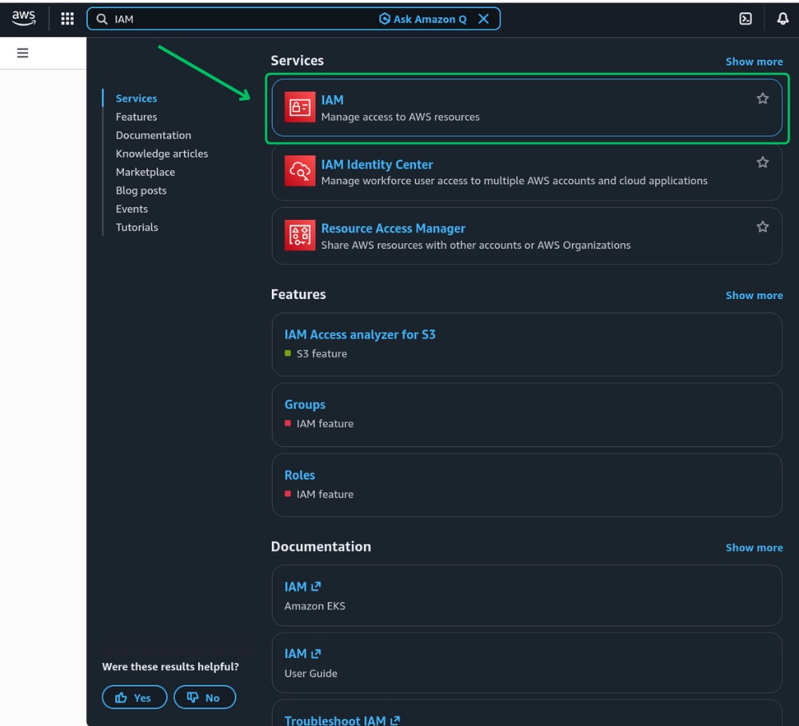
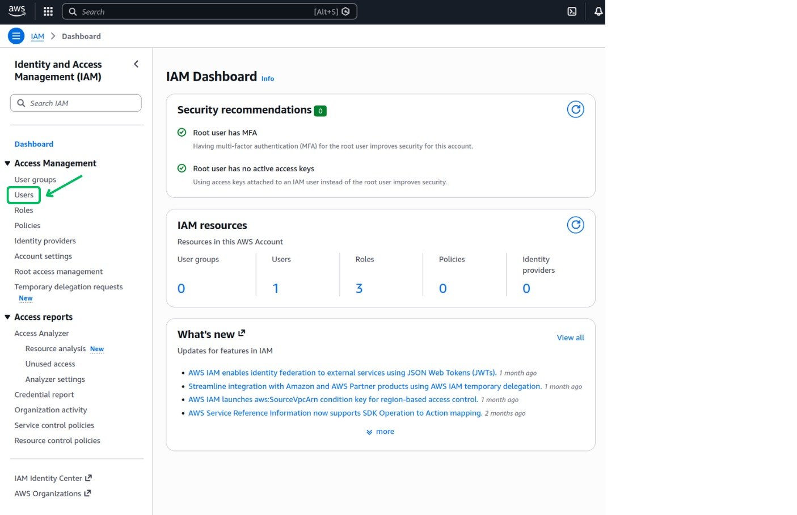
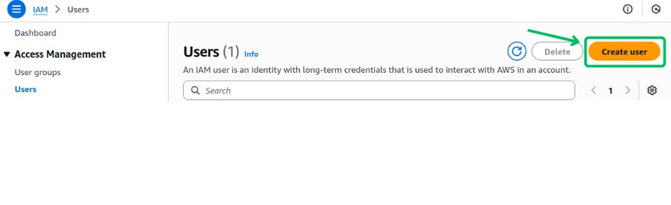
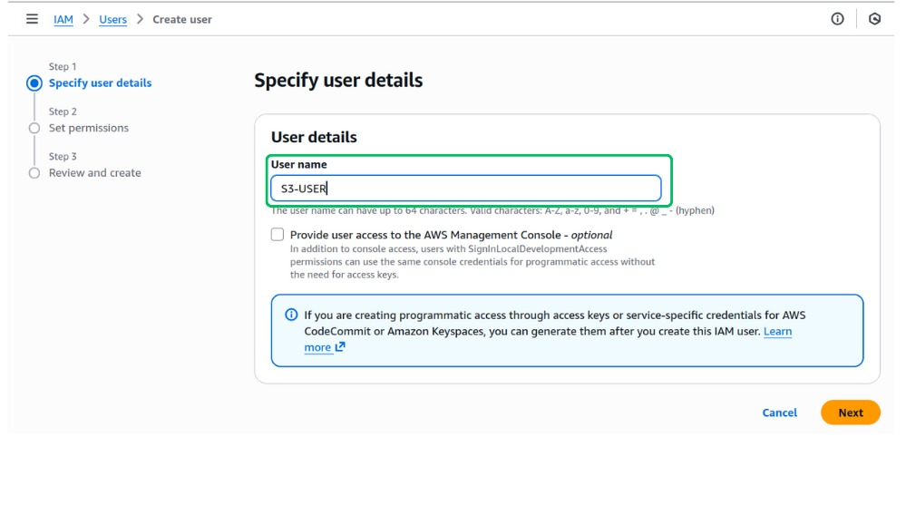
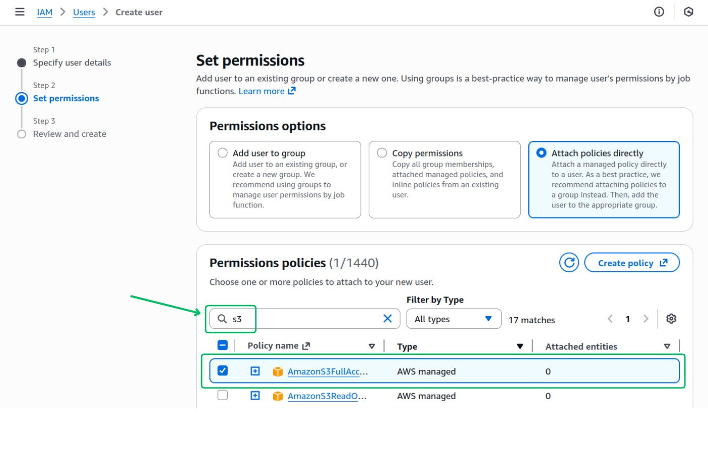
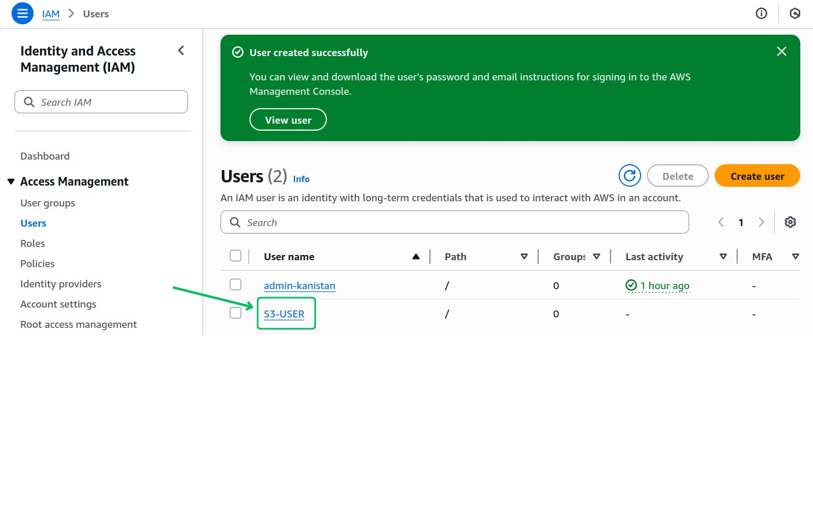
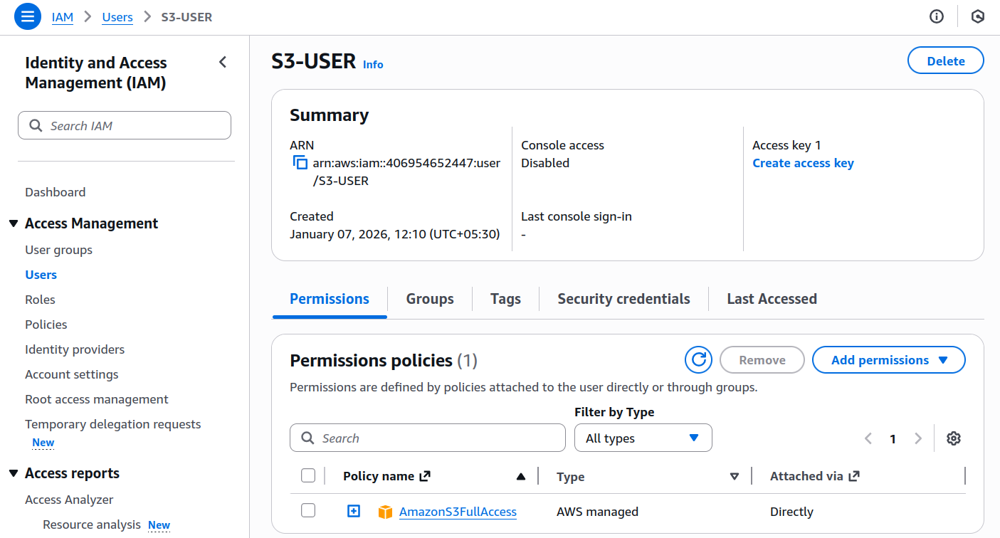
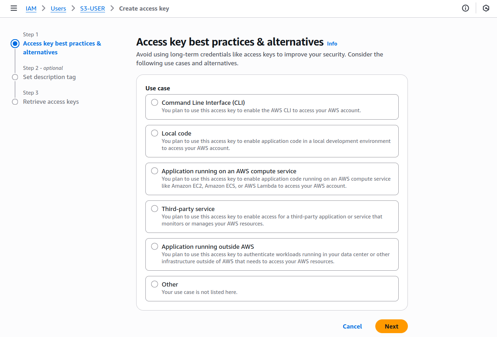
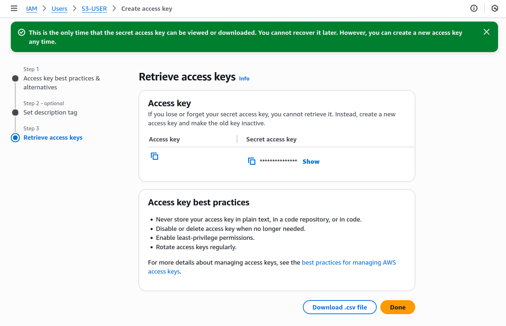

## Overview

[Amazon Simple Storage Service (Amazon S3)](https://docs.aws.amazon.com/AmazonS3/latest/userguide/Welcome.html) is a highly scalable, durable object storage service for storing and retrieving any amount of data.

The `ballerinax/aws.s3` connector enables Ballerina applications to interact with Amazon S3. It supports bucket management (create, list, delete), object operations (upload, download, copy, delete, metadata), streaming for large files, multipart uploads, presigned URLs, and flexible content retrieval with typed returns.

## Setup guide

### Login to AWS Console

Log into the [AWS Management Console](https://console.aws.amazon.com/console). If you don’t have an AWS account yet, you can create one by visiting the AWS [sign-up](https://aws.amazon.com/free/) page. Sign up is free, and you can explore many services under the Free Tier.

### Create a user

1. In the AWS Management Console, search for IAM in the services search bar.
2. Click on IAM

   

3. Click Users

   

4. Click Create User

   

5. Provide a suitable name for the user and continue

   

6. Add necessary permissions by adding the user to a user group, copy permissions or directly attach the policies. For S3, attach policies such as `AmazonS3FullAccess` (for development) or a least-privilege custom policy scoped to your buckets. Then click next.

   
7. Review and create the user

   

### Get user access keys

1. Click the user that was created.

   

2. Click `Create access key`.

   

3. Select your use case and click next.

   

4. Record the Access Key ID and Secret Access Key. These credentials will be used to authenticate your Ballerina application with Amazon S3.

   

## Quickstart

To use the `aws.s3` connector in your Ballerina project, modify the `.bal` file as follows.

### Step 1: Import the module

```ballerina
import ballerinax/aws.s3;
```

### Step 2: Instantiate a new connector

Create a new `s3:Client` by providing the region and authentication configurations.

```ballerina
configurable string accessKeyId = ?;
configurable string secretAccessKey = ?;

s3:Client s3Client = check new ({
   region: "us-east-1",
   auth: {
      accessKeyId,
      secretAccessKey
   }
});
```

#### Alternative authentication methods

##### Profile-based authentication

You can use AWS profile-based authentication as an alternative to static credentials.

```ballerina
s3:Client s3Client = check new ({
   region: "us-east-1",
   auth: {
      profileName: "myAwsProfile",
      credentialsFilePath: "/path/to/custom/credentials"
   }
});
```

> **Note:** Ensure your AWS credentials file follows the standard format.
>
> ```ini
> [default]
> aws_access_key_id = YOUR_ACCESS_KEY_ID
> aws_secret_access_key = YOUR_SECRET_ACCESS_KEY
>
> [myAwsProfile]
> aws_access_key_id = ANOTHER_ACCESS_KEY_ID
> aws_secret_access_key = ANOTHER_SECRET_ACCESS_KEY
> ```


### Step 3: Invoke the connector operations

Now, utilize the available connector operations.

#### Create a bucket
```ballerina
check s3Client->createBucket("my-s3-bucket");
```

#### Upload an object
```ballerina
// Upload from content
check s3Client->putObject("my-s3-bucket", "docs/readme.txt", "Hello from Ballerina!");

// Upload from a file path
check s3Client->putObjectFromFile("my-s3-bucket", "images/logo.png", "/path/to/logo.png");
```

#### Download an object (typed)
```ballerina
// Return as byte array
byte[] bytes = check s3Client->getObject("my-s3-bucket", "docs/readme.txt", Bytes);

// Return as string
string text = check s3Client->getObject("my-s3-bucket", "docs/readme.txt", string);
```

#### Download an object as a stream (for large files)
```ballerina
stream<byte[], error?> content = check s3Client->getObjectAsStream("my-s3-bucket", "videos/movie.mp4");
// Consume the stream in chunks
final byte[]? next = (); // placeholder to illustrate stream consumption
```

#### List and delete objects
```ballerina
// List objects in a bucket
aws.s3:ListObjectsResponse resp = check s3Client->listObjects("my-s3-bucket", {
   prefix: "docs/",
   maxKeys: 100
});

// Delete an object
check s3Client->deleteObject("my-s3-bucket", "docs/readme.txt");
```

#### Bucket utilities
```ballerina
// List buckets
aws.s3:Bucket[] buckets = check s3Client->listBuckets();

// Get bucket region
string region = check s3Client->getBucketLocation("my-s3-bucket");

// Delete a bucket
check s3Client->deleteBucket("my-s3-bucket");
```

#### Presigned URLs
```ballerina
// Generate a presigned URL for downloading an object
string url = check s3Client->createPresignedUrl("my-s3-bucket", "docs/readme.txt", {
   expirationMinutes: 30,
   httpMethod: "GET"
});
```

### Step 4: Run the Ballerina application

Use the following command to compile and run the Ballerina program.

```bash
bal run
```

## Examples

The `ballerinax/aws.s3` connector provides practical examples illustrating usage in various scenarios. Explore these [examples](https://github.com/ballerina-platform/module-ballerinax-aws.s3/tree/master/examples):

1. [**Authentication**](https://github.com/ballerina-platform/module-ballerinax-aws.s3/tree/master/examples/authentication) - Demonstrates how to authenticate with AWS S3 using static credentials.

2. [**Bucket Operations**](https://github.com/ballerina-platform/module-ballerinax-aws.s3/tree/master/examples/bucket-operations) - Shows how to create, list, get location, and delete S3 buckets.

3. [**Object Operations**](https://github.com/ballerina-platform/module-ballerinax-aws.s3/tree/master/examples/object-operations) - Demonstrates comprehensive object operations including upload/download with different content types (String, JSON, XML, Byte[]), metadata retrieval, copying, and existence checks.

4. [**Multipart Uploads**](https://github.com/ballerina-platform/module-ballerinax-aws.s3/tree/master/examples/multipart-uploads) - Shows how to handle large file uploads using S3 multipart upload API with multiple parts.

5. [**Stream Operations**](https://github.com/ballerina-platform/module-ballerinax-aws.s3/tree/master/examples/stream-operations) - Demonstrates memory-efficient streaming operations for uploading and downloading large files.

